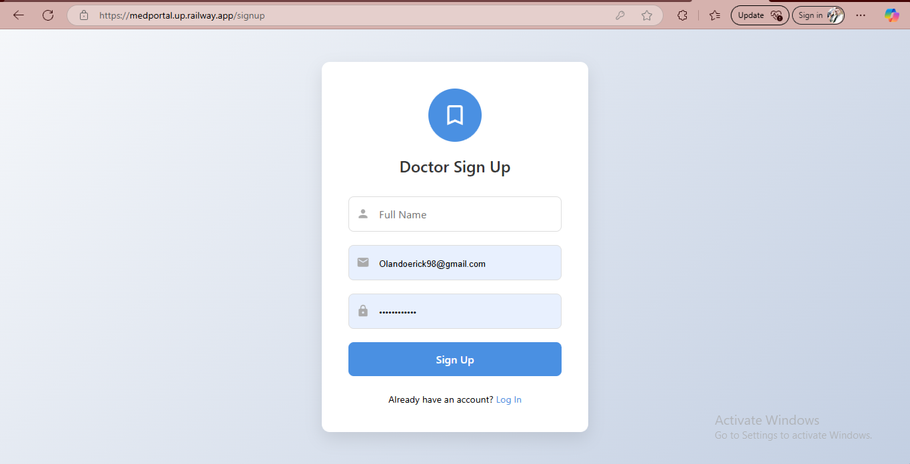
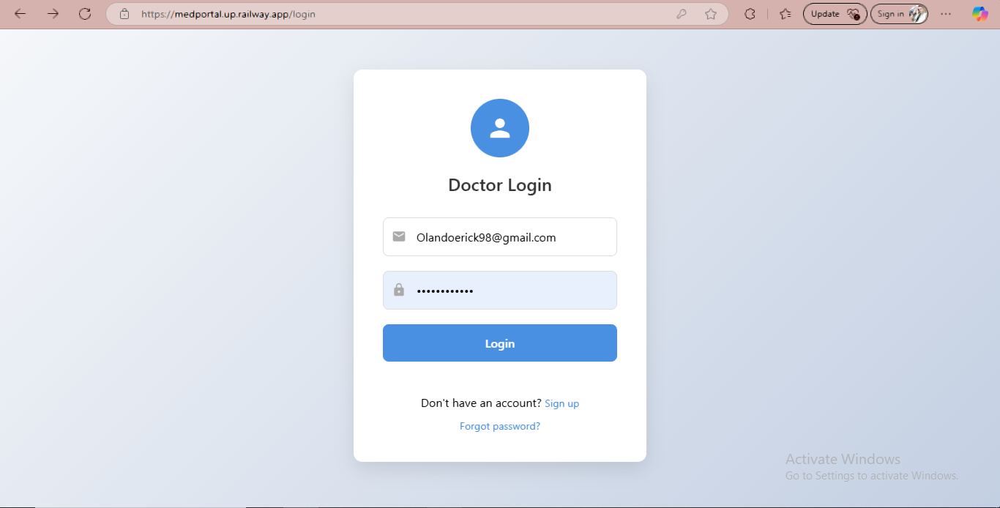
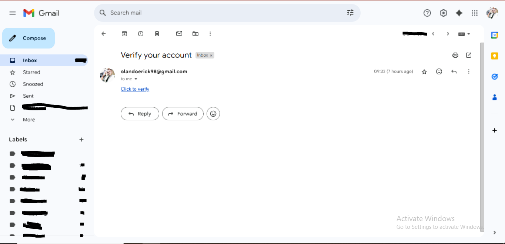
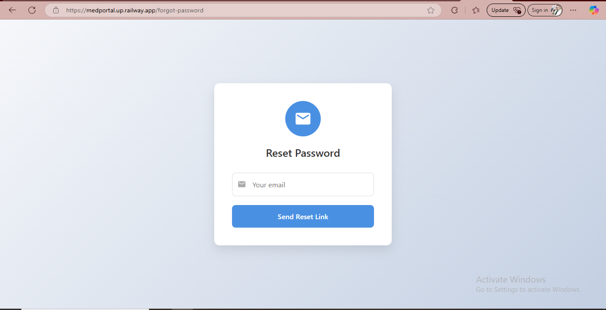

# Med Portal Web App Documentation

## Table of Contents
- [Overview](#overview)
- [Features](#features)
  - [Authentication and User Management](#authentication-and-user-management)
  - [Client Management](#client-management)
  - [Program Management](#program-management)
  - [Dashboard](#dashboard)
- [Technical Stack](#technical-stack)
- [Directory Structure](#directory-structure)
- [API Routes](#api-routes)
  - [Authentication](#authentication)
  - [Client Management](#client-management-routes)
  - [Program Management](#program-management-routes)
  - [Dashboard](#dashboard-routes)
  - [Test APIs](#test-apis)
- [Database Configuration](#database-configuration)
- [Email Configuration](#email-configuration)
- [Running the App Locally](#running-the-app-locally)
- [Conclusion](#conclusion)

## Overview

The Med Portal Web App is a comprehensive platform designed for doctors to manage their clients, programs, and appointments. It features a robust backend built with Node.js, PostgreSQL, and ES6 imports, along with a responsive frontend using EJS templates and partials. The app includes various API routes for user authentication, client management, and program enrollment. It also integrates with SMTP Gmail services for email notifications.

## Features

### Authentication and User Management

- **Doctor Sign In**: Doctors can log in using their credentials.
- **Doctor Registration**: New doctors can register for an account.
- **Forgot Password**: Doctors can reset their passwords if forgotten.
- **Verify Account**: Doctors can verify their accounts.
- **Delete Doctor Account**: Doctors can delete their own accounts.
- **Delete Client Account**: Doctors can delete client accounts.
  
### Client Management

- **Client Registration**: Doctors can register new clients.
- **Client Profile**: Doctors can view client profiles, including personal details and enrolled programs.
- **Enroll Client in Programs**: Doctors can enroll clients in multiple programs.
- **Client Cards**: Registered clients are displayed as cards in the dashboard, which are clickable to view detailed profiles.
- **Email Notifications**: Clients receive an email notification upon registration.

### Program Management

- **Add Programs**: Doctors can add multiple programs.
- **Enroll Clients in Programs**: Clients can be enrolled in more than one program.

### Dashboard

- **Responsive Design**: The dashboard is designed to feel like a mobile app and is fully responsive on all devices.
- **Pagination**: Client cards are paginated for better usability when there are many clients.
- **Search Bar**: Doctors can search for clients by name.

## Technical Stack

- **Backend**: Node.js, PostgreSQL, ES6 imports
- **Frontend**: EJS templates and partials
- **Email Service**: SMTP Gmail service
- **API Routes**: GET, POST, DELETE methods

## Directory Structure

# Project Structure

```text
med-portal-web-app/
├── Database/        
│   └── db.js
├── Transporter/        
│   └── email.js
├── Test_apis/        
│   ├── getclient.js
│   ├── getAllUsers.js
│   └── programs.js
├── api_Routes/          
│   ├── GET/            
│   │   ├── home.js
│   │   ├── signup.js
│   │   ├── login.js
│   │   ├── dashboard.js
│   │   ├── verify_token.js
│   │   ├── logout.js
│   │   ├── addProgram.js
│   │   ├── clientRegister.js
│   │   ├── programEnroll.js
│   │   ├── forgot_password.js
│   │   ├── deleteAccount.js
│   │   ├── resetToken.js
│   │   └── clients.js
│   ├── POST/           
│   │   ├── signup_post.js
│   │   ├── login_post.js
│   │   ├── programADD_post.js
│   │   ├── clientRegister_post.js
│   │   ├── programsEnrol.js
│   │   ├── forgotPassword_post.js
│   │   └── processToken.js
│   └── DELETE/          
│       ├── clientDelete.js
│       └── doctorDelete.js
├── views/              
│   ├── partials/        
│   │   ├── home/
│   │   ├── login/
│   │   ├── register/
│   │   ├── dashboard/
│   │   ├── clientProfile/
│   │   └── program/
│   ├── index.ejs
│   ├── login.ejs
│   ├── register.ejs
│   ├── dashboard.ejs
│   ├── clientProfile.ejs
│   └── program.ejs
├── node_modules/      
├── .gitignore           
├── index.js             
└── package.json          

```

## API Routes

### Authentication

- **GET /signup**: Display the signup form.
  
- **POST /signup-post**: Handle doctor registration.
  
- **GET /login**: Display the login form.
  
- **POST /login**: Handle doctor login.
  
- **GET /verify**: Verify the doctor's account.
  
- **GET /logout**: Log out the doctor.
  
- **GET /forgot-password**: Display the forgot password form.
  
- **POST /forgot-password**: Handle forgot password request.
  
- **GET /reset-password**: Display the reset password form.
  
- **POST /reset-password**: Handle password reset.
  

### Client Management Routes

- **GET /clients/register**: Display the client registration form.
  
- **POST /clients/register_post**: Handle client registration.
  
- **GET /clients**: Display all clients.
  
- **DELETE /clients/:id**: Delete a client by ID.
  

### Program Management Routes

- **GET /programs/add**: Display the program addition form.
  
- **POST /programs/add**: Handle adding a new program.
  
- **GET /programs/enroll**: Display the program enrollment form.
  
- **POST /programs/enroll**: Handle enrolling a client in a program.
  

### Dashboard Routes

- **GET /dashboard**: Display the dashboard with client cards and search functionality.
  

### Test APIs

- **GET /api/clients**: Get all clients (test route).
  
- **GET /api/users**: Get all users (test route).
  
- **GET /api/programs-per-doctor**: Get programs per doctor (test route).
  

## Database Configuration

- **Database**: PostgreSQL
- **Configuration**: `Database/db.js`

```javascript
// Database/db.js
import pg from 'pg';
const { Pool } = pg;

const pool = new Pool({
  user: process.env.PGUSER,
  password: process.env.PGPASSWORD,
  database: process.env.PGDATABASE,
  host: process.env.PGHOST,
  port: YOUR DB PORT NUMBER,
});

export default pool;

##Email Configuration
**Service**: SMTP Gmail
**Configuration**: Transporter/email.js

```javascript
let transporter = nodemailer.createTransport({
  host: process.env.EMAIL_HOST,
  port: process.env.EMAIL_PORT,
  secure: process.env.EMAIL_PORT === "465",
  auth: {
    user: process.env.EMAIL_USER,
    pass: process.env.EMAIL_PASS
  },
  tls: {
    rejectUnauthorized: false
  }
});
```

## Running the App Locally

### Clone the Repository
```bash
git clone https://github.com/your-repo/CEMA_health_system.git
```

### Install Dependencies
```bash
npm install
```

### Run the App
```bash
nodemon index.js
```

## Conclusion

The Med portal Web App is a fully functional web application designed to streamline the management of clients and programs for doctors. It is built with modern technologies and follows best practices for security and usability. This project can serve as a strong foundation for more advanced healthcare management systems.


# How to Use the Web Application

## Step 1: Signup
- To use the application, first, sign up as a user by providing your details (email, password, etc.).

## Step 2: Add a Program
- Once you're signed in, go to the "Add Program" section.
- Enter the details of the program you want to create.
- Click "Add Program" to save the new program.

## Step 3: Register a Client
- After adding a program, go to the "Register Client" section.
- Fill in the client details such as name, email, and phone number.
- Click "Register Client" to save the new client.

## Step 4: Enroll a Client to a Program
- After registering a client, go to the "Enroll Client" section.
- Select the client and the program you want to enroll them in.
- Click "Enroll" to add the client to the selected program.

That's it! You can now manage your clients and programs in the web application.
#


